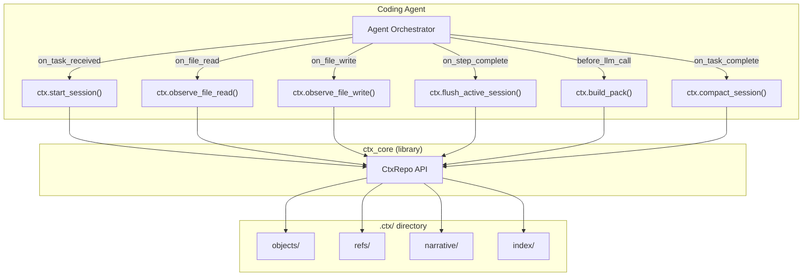
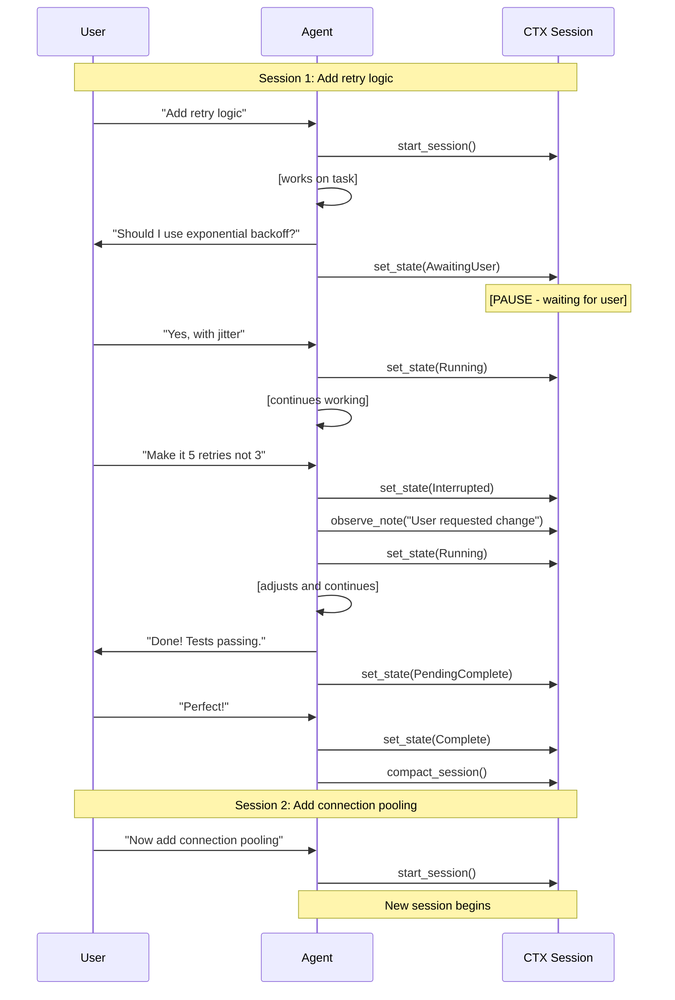
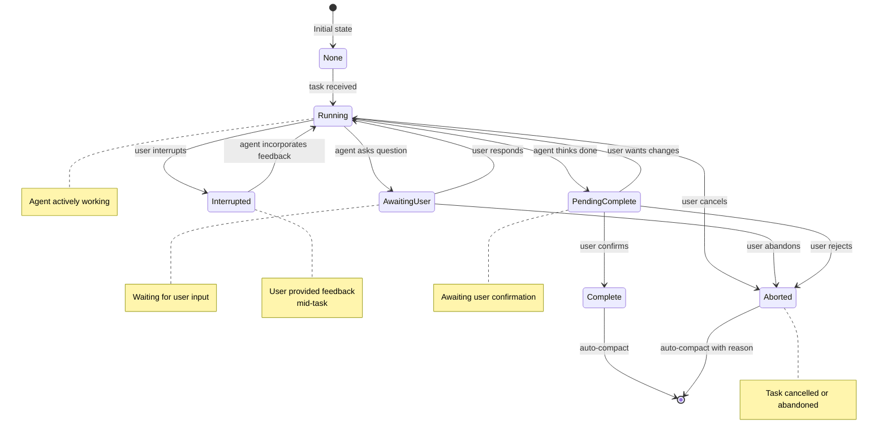

<div align="center">
  
</div>

# CTX


**Context management for coding agents.**

CTX gives coding agents persistent memory. Instead of forgetting everything between sessions, agents remember past decisions, understand code relationships, and build on previous work.

```
Agent: "What did we decide about retry logic?"

CTX retrieves:
  - The decision record from last week
  - The client.rs file that implements it
  - Related functions that call it  
  - Notes from when it broke in testing
```

---

## Research Background

This project builds on ideas from recent research:

> "Git Context Controller: Manage the Context of LLM-Based Agents Like Git"  
> Junde Wu, University of Oxford  
> arXiv:2508.00031, July 2025

The paper shows that version-control semantics for agent memory improves performance on coding benchmarks. CTX extends this with content-addressed storage, automatic code analysis, and graph-based retrieval.

---

## Why CTX?

Coding agents have a memory problem.

Every session starts fresh. The agent doesn't remember what you discussed yesterday, what architectural decisions were made, or why certain approaches were rejected. You end up re-explaining context over and over.

Current solutions compress history into summaries, but summaries lose detail. Or they stuff everything into the prompt, but that gets slow and expensive.

CTX takes a different approach: treat agent memory like a codebase. Version it. Structure it. Make it queryable. When the agent needs context, retrieve exactly what's relevant.

---

## How It Works

CTX stores everything as immutable, content-addressed objects (like Git). Files, decisions, relationships between code entities. All of it gets hashed, compressed, and stored.

On top of that, CTX builds a semantic graph. It knows that `client.rs` imports `connection.rs`, that the `retry` function calls `backoff`, that task #42 mentions the auth module. These relationships power retrieval.

When an agent needs context, CTX:

1. Identifies seed nodes from the query ("retry logic" maps to `retry` function, retry-related tasks)
2. Expands through the graph (what does `retry` call? what calls it?)
3. Loads the relevant content
4. Packs it into a prompt-ready format

The agent gets exactly the context it needs, nothing more.

---

## Library-First Design

CTX is a library that your agent imports and calls. The CLI exists for debugging, but the real interface is the Rust API. Users never interact with CTX directly. The agent handles everything.



---

## Sessions and Task Boundaries

A session represents one logical unit of work. This is important to get right, because sessions determine what gets grouped together in history.

### Sessions Map to Conversations, Not Agent Runs

A session spans an entire conversation about a task, including:

- The initial request
- Questions the agent asks and user answers
- Modifications the user requests mid-task
- The final confirmation

All of this is one session. It only ends when the user confirms completion or starts a completely different task.



### Session States

Sessions move through explicit states:

```rust
pub enum SessionState {
    // Agent is actively working
    Running,
    
    // Waiting for user input (question asked)
    AwaitingUser {
        question: String,
        asked_at: i64,
    },
    
    // User interrupted mid-task with feedback
    Interrupted {
        user_message: String,
    },
    
    // Agent thinks task is complete, awaiting confirmation
    PendingComplete {
        summary: String,
    },
    
    // Session fully complete, ready for compaction
    Complete,
    
    // Session aborted
    Aborted {
        reason: String,
    },
}
```

### State Transitions



### Classifying User Messages

When a user message arrives, the agent classifies it to decide what to do with the session:

| User Says | Classification | Session Action |
|-----------|----------------|----------------|
| "Yes, use jitter" | Response | Continue session, resume working |
| "Make it 5 retries" | Modification | Continue session, adjust and keep going |
| "Looks good!" | Confirmation | Compact session, end |
| "Never mind" | Abandon | Compact partial work, end |
| "Now add pooling" | NewTask | Compact current session, start new one |

Time gaps do not end sessions. A user can ask a question, close their laptop, come back the next day, and continue. Staging preserves all state. The session is a logical boundary, not a temporal one.

However, very long gaps trigger special handling:

| Idle Time | User Says Anything | Behavior |
|-----------|-------------------|----------|
| < 24 hours | New task | Ask: save old work and start fresh? |
| < 24 hours | Continuation | Resume automatically |
| 24h - 7 days | Anything | Ask: continue old work or start fresh? |
| > 7 days | Anything | Auto-compact old session, proceed with new |

This prevents "dangling" sessions from accumulating while still giving users a chance to continue recent work.

---

## Integrating CTX Into Your Agent

### Basic Setup

```rust
use ctx_core::{CtxRepo, Session, RetrievalConfig};

// Open the context repository
let mut ctx = CtxRepo::open("./project")?;

// Or initialize a new repository
let mut ctx = CtxRepo::init("./project")?;
```

### Starting a Session

When the user gives the agent a task:

```rust
// Start tracking this task
// Returns &mut Session - a borrowed reference to the active session
let session = ctx.start_session("Add retry logic to the HTTP client")?;
```

This creates a staging area and records the task in the narrative log.

### Observing Agent Actions

As the agent works, it reports what it does. CTX decides what to persist.

You can use convenience methods on `CtxRepo` that work with the active session:

```rust
// Agent reads a file (for reasoning, not just listing)
ctx.observe_file_read("src/http/client.rs")?;

// Or record the read WITH content snapshot (for temporal reconstruction)
let content = fs::read("src/http/client.rs")?;
ctx.observe_file_read_with_content("src/http/client.rs", &content)?;

// Agent writes a file
ctx.observe_file_write("src/http/client.rs", &new_content)?;

// Agent runs a command
ctx.observe_command(
    "cargo test",
    Some(0),  // exit_code: Option<i32>
    Some(&output_bytes),  // output: Option<&[u8]>
)?;

// Agent records a decision
ctx.observe_note("Chose exponential backoff over fixed delay")?;
```

Alternatively, you can access the session directly:

```rust
// Get mutable reference to active session
let session = ctx.active_session_mut().unwrap();

// Direct session methods require object_store and refs
session.observe_file_read("src/http/client.rs")?;
session.observe_file_write("src/http/client.rs", &content, &ctx.object_store())?;
session.observe_command("cargo test", Some(0), Some(&output), &ctx.object_store())?;
session.observe_note("Chose exponential backoff")?;
```

### Checkpointing Progress

After completing a logical step, flush to staging. This is the crash-safety boundary.

Using the convenience method:

```rust
ctx.flush_active_session()?;
```

Or directly on the session:

```rust
let session = ctx.active_session_mut().unwrap();
session.flush_step(&ctx.object_store(), &ctx.refs())?;
```

If the process crashes after a flush, all work up to that point is recoverable.

### Handling Questions and Pauses

When the agent needs user input:

```rust
// Agent asks a question
let session = ctx.active_session_mut().unwrap();
session.set_state(SessionState::AwaitingUser {
    question: "Should I use exponential backoff or fixed delay?".into(),
    asked_at: now(),
})?;
ctx.flush_active_session()?;

// ... time passes, could be minutes or days ...

// User responds, agent resumes
ctx.observe_note("User chose exponential backoff")?;
let session = ctx.active_session_mut().unwrap();
session.set_state(SessionState::Running)?;
```

### Handling User Interventions

When the user interrupts mid-task:

```rust
// User says "make it 5 retries instead of 3"
let session = ctx.active_session_mut().unwrap();
session.set_state(SessionState::Interrupted {
    user_message: "make it 5 retries instead of 3".into(),
})?;

// Agent incorporates the feedback
ctx.observe_note("User requested: change max retries to 5")?;
let session = ctx.active_session_mut().unwrap();
session.set_state(SessionState::Running)?;

// Continue working with the modification
```

### Completing a Task

When the agent thinks it's done:

```rust
// Agent presents results
let session = ctx.active_session_mut().unwrap();
session.set_state(SessionState::PendingComplete {
    summary: "Added retry logic with exponential backoff and jitter".into(),
})?;
ctx.flush_active_session()?;

// ... user responds ...

// If user confirms
let session = ctx.active_session_mut().unwrap();
session.set_state(SessionState::Complete)?;
ctx.compact_session("Added retry logic with exponential backoff and jitter")?;
// Session is now None, staging is cleared, canonical commit created
```

If the user wants modifications instead, transition back to Running and continue.

### Building Context for LLM Calls

When the agent needs to call the LLM:

```rust
let pack = ctx.build_pack("How should I handle connection timeouts?", &RetrievalConfig {
    token_budget: 8000,
    expansion_depth: 2,
    include_active_task: true,
    include_log: true,
    narrative_days: 7,
    ..Default::default()
})?;

// pack.retrieved contains relevant code snippets
// pack.recent_narrative contains recent notes
// pack.graph_context contains relationship info

let prompt = format!("{}\n\n## Question\n{}", pack.to_text(), query);
let response = llm.complete(&prompt).await?;
```

---

## Full Integration Example

Here's how it all fits together:

```rust
pub struct CodingAgent {
    ctx: CtxRepo,
    llm: LlmClient,
}

impl CodingAgent {
    pub async fn handle_user_message(&mut self, message: &str) -> Result<String> {
        // Classify the message
        let classification = self.classify_message(message).await?;
        
        match classification {
            MessageKind::NewTask => {
                // Compact any existing session first
                if self.ctx.has_active_session() {
                    self.ctx.compact_session("Task interrupted by new task")?;
                }
                
                // Start fresh session
                self.ctx.start_session(message)?;
                self.work_on_task(message).await
            }
            
            MessageKind::Response | MessageKind::Modification => {
                // Continue existing session
                self.ctx.observe_note(&format!("User: {}", message))?;
                let session = self.ctx.active_session_mut().unwrap();
                session.set_state(SessionState::Running)?;
                self.continue_working().await
            }
            
            MessageKind::Confirmation => {
                // Complete the session
                if let Some(session) = self.ctx.active_session_mut() {
                    session.set_state(SessionState::Complete)?;
                    let summary = session.task_description().to_string();
                    self.ctx.compact_session(&summary)?;
                }
                Ok("Done! Changes have been saved.".into())
            }
            
            MessageKind::Abandon => {
                // Compact partial work and end
                if self.ctx.has_active_session() {
                    self.ctx.compact_session("Task abandoned by user")?;
                }
                Ok("Okay, I've saved what we had so far.".into())
            }
        }
    }
    
    async fn work_on_task(&mut self, task: &str) -> Result<String> {
        // Get context for planning
        let pack = self.ctx.build_pack(task, &RetrievalConfig::default())?;
        
        // Plan the work
        let plan_text = self.create_plan(&pack, task).await?;
        self.ctx.observe_plan(&plan_text)?;
        
        // Execute steps
        for step in &plan_text.split('\n').collect::<Vec<_>>() {
            self.execute_step(step).await?;
            self.ctx.flush_active_session()?;
        }
        
        // Present completion
        let session = self.ctx.active_session_mut().unwrap();
        session.set_state(SessionState::PendingComplete {
            summary: plan_text.clone(),
        })?;
        self.ctx.flush_active_session()?;
        
        Ok(format!("Done! {}\n\nDoes this look good?", plan_text))
    }
    
    async fn execute_step(&mut self, step: &str) -> Result<()> {
        // Build context for this step
        let pack = self.ctx.build_pack(step, &RetrievalConfig::default())?;
        
        // Ask LLM what to do
        let actions = self.get_actions(&pack, step).await?;
        
        // Execute actions
        for action in actions {
            match action {
                Action::ReadFile(path) => {
                    let content = fs::read_to_string(&path)?;
                    self.ctx.observe_file_read_with_content(&path, content.as_bytes())?;
                }
                Action::WriteFile(path, content) => {
                    fs::write(&path, &content)?;
                    self.ctx.observe_file_write(&path, content.as_bytes())?;
                }
                Action::RunCommand(cmd) => {
                    let output = run_command(&cmd)?;
                    self.ctx.observe_command(
                        &cmd,
                        Some(output.exit_code),
                        Some(&output.stdout),
                    )?;
                }
            }
        }
        
        Ok(())
    }
}
```

---

## Multi-Turn Conversation Example

Here's a complete conversation flow showing state transitions:

```
TURN 1: User initiates task
------------------------------------------------------------------------
User: "Add retry logic to the connect function"

Agent internal:
  - classify: NewTask
  - ctx.start_session("Add retry logic...")
  - session.state = Running
  - [reads files, makes plan]
  - ctx.observe_file_read_with_content("src/http/client.rs", ...)
  - ctx.observe_plan("Plan: Add retry with exponential backoff...")

Agent: "I'll add retry logic. Should I use:
        A) Fixed delay
        B) Exponential backoff
        C) Exponential with jitter"

Agent internal:
  - ctx.flush_active_session()
  - session.state = AwaitingUser { question: "..." }


TURN 2: User responds (could be minutes or days later)
------------------------------------------------------------------------
User: "Option C, and make max retries configurable"

Agent internal:
  - classify: Response
  - ctx.observe_note("User: Option C, configurable")
  - session.state = Running
  - [implements the feature]
  - ctx.observe_file_write("src/http/client.rs", ...)
  - ctx.observe_command("cargo test", Some(0), Some(&output))

Agent: "Done! Tests pass. Here's what I added: [summary]
        Does this look good?"

Agent internal:
  - session.state = PendingComplete { summary: "..." }


TURN 3: User wants a modification
------------------------------------------------------------------------
User: "Looks good but also add logging for retry attempts"

Agent internal:
  - classify: Modification
  - ctx.observe_note("User: add logging")
  - session.state = Running
  - [adds logging]
  - ctx.observe_file_write(...)

Agent: "Added logging. Each retry now logs attempt number,
        delay, and error. All tests pass. Done?"

Agent internal:
  - session.state = PendingComplete { summary: "..." }


TURN 4: User confirms
------------------------------------------------------------------------
User: "Perfect, thanks!"

Agent internal:
  - classify: Confirmation
  - session.state = Complete
  - ctx.compact_session("Added retry logic with exponential
      backoff, jitter, configurable max retries, and logging")
  - session = None

[CANONICAL COMMIT CREATED]

Agent: "Great! Changes saved. Let me know if you need anything else."


TURN 5: User starts new task
------------------------------------------------------------------------
User: "Now let's add connection pooling"

Agent internal:
  - classify: NewTask
  - ctx.start_session("Add connection pooling")
  - [new session begins, can retrieve context from previous work]
```

---

## Handling Stale Sessions

What happens when a user closes the app mid-session, comes back days later, and starts something completely different? The old session is sitting in staging, never compacted.

CTX handles this with time-based heuristics:

```rust
use ctx_core::{CtxRepo, StaleSessionConfig, StaleSessionStatus};

pub struct CodingAgent {
    ctx: CtxRepo,
    llm: LlmClient,
}

impl CodingAgent {
    pub async fn handle_user_message(&mut self, message: &str) -> Result<String> {
        // Check for existing session first
        let config = StaleSessionConfig::default();
        let status = self.ctx.check_stale_session(&config);
        
        match status {
            StaleSessionStatus::NoSession => {
                // No existing session, proceed normally
            }
            
            StaleSessionStatus::Fresh { task, idle_secs } => {
                // Recent session - classify message to decide
                let classification = self.classify_message(message).await?;
                
                if classification == MessageKind::NewTask {
                    // New task while recent session exists - ask user
                    return Ok(format!(
                        "You have unfinished work on: {}\n\n\
                         Should I:\n\
                         A) Save that and start on your new request\n\
                         B) Continue where we left off",
                        task
                    ));
                }
                // Otherwise, continue with existing session
            }
            
            StaleSessionStatus::ShouldAsk { task, idle_secs } => {
                // Been a while - ask explicitly regardless of message content
                return Ok(format!(
                    "Welcome back! Last time you were working on: {}\n\n\
                     Would you like to:\n\
                     A) Continue that work\n\
                     B) Save it and start fresh",
                    task
                ));
            }
            
            StaleSessionStatus::ShouldAutoCompact { task, idle_secs } => {
                // Stale session - auto-compact and proceed
                self.ctx.compact_session(&format!(
                    "Auto-saved stale session: {}", 
                    task
                ))?;
                // Fall through to handle message normally
            }
        }
        
        // Normal message handling...
    }
}
```

The key insight: sessions can go stale, and that's okay. CTX preserves whatever work was done (via compaction) rather than losing it. The user can always retrieve it from history later if needed.

For very long idle periods, you might also want a background cleanup:

```rust
// Optional: run periodically or on startup
impl CtxRepo {
    pub fn cleanup_stale_sessions(&mut self, max_age: Duration) -> Result<CleanupReport> {
        // This method exists and returns a report of what was compacted
        let report = self.cleanup_stale_sessions(max_age)?;
        println!("Compacted {} stale sessions", report.sessions_compacted);
        Ok(report)
    }
}
```

---

## Recovering from Crashes

If the process crashes mid-session:

```rust
// On startup, check for existing session
if let Some(session) = ctx.recover_session()? {
    match session.state() {
        SessionState::AwaitingUser { question, .. } => {
            // Re-ask the question
            println!("I was asking: {}", question);
        }
        SessionState::PendingComplete { summary, .. } => {
            // Re-present completion
            println!("I had finished: {}\nDoes this look good?", summary);
        }
        SessionState::Running => {
            // Was interrupted mid-work
            let progress = session.generate_progress_summary(&ctx.object_store())?;
            println!("Was working on this: {}\nShould I continue?", progress);
        }
        _ => {}
    }
}
```

All work up to the last `flush_step()` is recoverable.

---

## What Gets Stored

| Event | What CTX Stores |
|-------|-----------------|
| File read | Snapshot of file content, extracted symbols and imports |
| File write | New version, diff from previous, updated relationships |
| Command run | Exit code, output, parsed diagnostics |
| Decision/note | Entry in narrative log, edges to mentioned entities |
| Task start | Task description, links to mentioned files |
| Task complete | Summary, outcome, canonical commit |

---

## On-Disk Structure

```
.ctx/
├── objects/          # Immutable, content-addressed blobs
├── refs/             # Pointers (HEAD, main, STAGE)
├── narrative/        # Human-readable markdown
│   ├── log/          # Daily session logs  
│   ├── tasks/        # Task tracking
│   └── decisions.md  # Architectural decisions
├── index/            # Rebuildable indexes (gitignored)
└── config.toml
```

---

## CLI (For Debugging)

The CLI is for debugging and manual intervention, not normal operation:

```bash
ctx init                      # Initialize .ctx/ directory
ctx debug history             # View commit history
ctx debug cat <object-id>     # Inspect objects
ctx debug graph               # Export relationship graph
ctx rebuild                   # Regenerate indexes
ctx gc                        # Clean up old objects
ctx stage abort               # Emergency: discard stuck session
```

---

## Installation

```bash
git clone https://github.com/yourorg/ctx
cd ctx
cargo build --release
```

As a dependency:

```toml
[dependencies]
ctx_core = { git = "https://github.com/yourorg/ctx" }
```

Requirements: Rust 1.75+

---

## Project Status

CTX is under active development. See `docs/PRD.md` for the full specification.

---

## License

Licensed under either of

- Apache License, Version 2.0 ([LICENSE-APACHE](LICENSE-APACHE) or http://www.apache.org/licenses/LICENSE-2.0)
- MIT license ([LICENSE-MIT](LICENSE-MIT) or http://opensource.org/licenses/MIT)

at your option.

### Contribution

Unless you explicitly state otherwise, any contribution intentionally submitted
for inclusion in the work by you, as defined in the Apache-2.0 license, shall be
dual licensed as above, without any additional terms or conditions.
